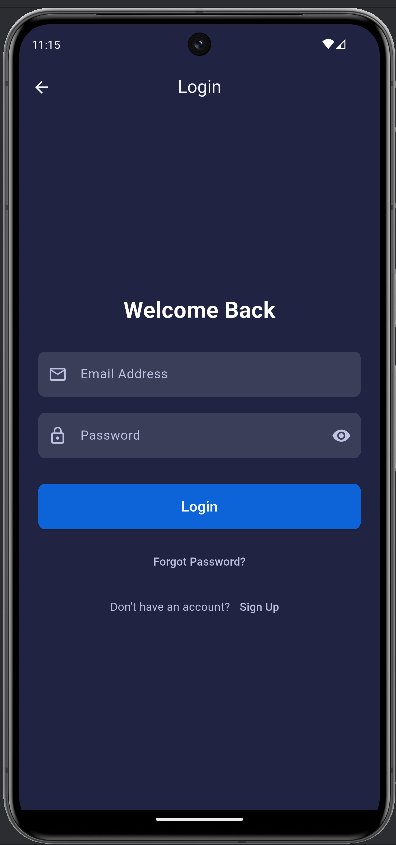
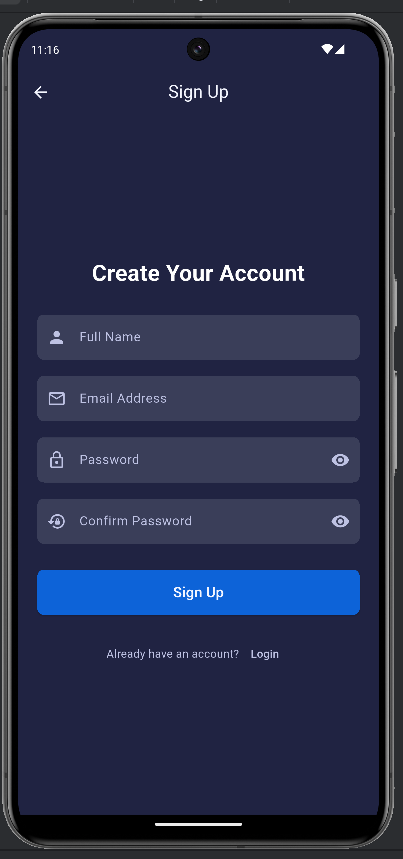
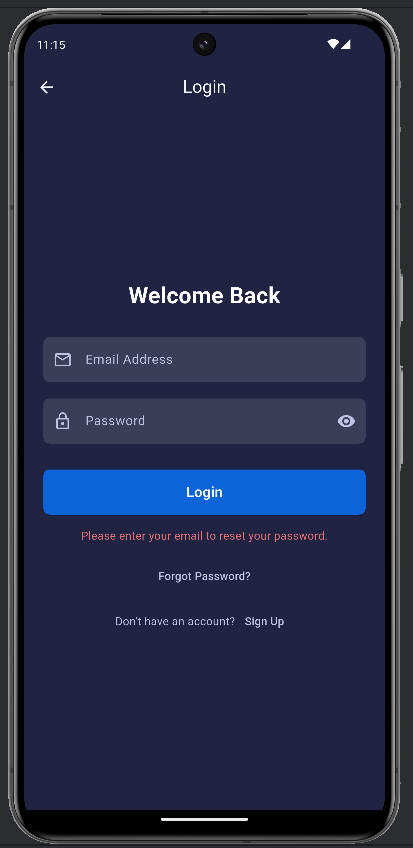

---

# EMS - Employee Management System Flutter App

A comprehensive Flutter application designed for managing employee records. It features a modern user interface, Firebase authentication (Email/Password), and real-time data synchronization with Cloud Firestore for full CRUD (Create, Read, Update, Delete,Search) operations.

## App Preview

|                            Login Screen                            |                                 Sign Up Screen                                  |                                      Forgot Password                                      |
|:------------------------------------------------------------------:|:-------------------------------------------------------------------------------:|:-----------------------------------------------------------------------------------------:|
|  |  |  |
|                          **Home Screen**                           |                              **Add/Edit Employee**                              |                                        **Dialogs**                                        |
|       |                                     |                                     |
*(Note: Replace the empty `src=""` with links to your actual screenshots)*

---

## ✨ Features Implemented

### 🔑 Authentication
-   **Email & Password Sign-Up:** Users can create a new account with their name, email, and password.
-   **Email & Password Login:** Secure login for registered users.
-   **Forgot Password:** Functionality to send password reset instructions.
-   **Persistent Login:** User session is managed by Firebase, keeping them logged in.
-   **Secure Sign-Out:** Users can sign out with a confirmation dialog to prevent accidental logouts.

### 👥 Employee Management (CRUD)
-   **Create:** Add new employees to the database via a dedicated form with real-time validation.
-   **Read:** Display a real-time, scrollable list of all employees from the Firestore database.
-   **Update:** Long-press any employee card to open a pre-filled form and update their details.
-   **Delete:** Delete any employee record with a confirmation dialog to prevent data loss.

### 🎨 UI & UX
-   **Modern Design:** A clean, modern UI with a consistent color scheme and layout across all screens.
-   **Dark Theme:** Utilizes a visually appealing dark theme for forms and primary UI elements.
-   **Responsive Layout:** The UI adapts to the on-screen keyboard by hiding the bottom navigation bar, preventing layout overflow issues.
-   **Real-time Validation:** Forms provide instant feedback to the user on input errors (e.g., invalid email format, weak password).
-   **Live Search:** The home screen features a search bar to filter the employee list by **name** or **role** in real-time.
-   **User Feedback:** The app provides clear feedback for actions using `SnackBar` messages (for success/error on CUD operations) and interactive `AlertDialogs` for confirmation.
-   **Loading Indicators:** Buttons and lists show loading spinners during asynchronous operations to inform the user that something is happening.

---

## 🚀 Setup Instructions

Follow these steps to get the project up and running on your local machine.

### 1. Prerequisites
-   You must have [Flutter](https://flutter.dev/docs/get-started/install) installed on your machine.
-   You must have a code editor like VS Code or Android Studio with the Flutter plugin installed.
-   You must have a Google account to create a Firebase project.

### 2. Clone the Repository
```bash
git clone <your-repository-url>
cd <your-project-directory>
```

### 3. Install Dependencies
Run the following command in your project's root directory to install all the required packages.
```bash
flutter pub get
```

### 4. Firebase Setup
This project requires a Firebase backend. Follow these steps carefully.

1.  **Create a Firebase Project:**
    -   Go to the [Firebase Console](https://console.firebase.google.com/).
    -   Click on "Add project" and follow the on-screen instructions to create a new project.

2.  **Register Your App:**
    -   Inside your new project, click the `</>` (web), iOS, or Android icon to register your app. You'll need to provide a package name (for Android, e.g., `com.example.ems_system`) or a bundle ID (for iOS).
    -   Follow the setup steps. For Android, you will download a `google-services.json` file. For iOS, you will download a `GoogleService-Info.plist` file.

3.  **Place Firebase Config Files:**
    -   **Android:** Place the downloaded `google-services.json` file in the `android/app/` directory.
    -   **iOS:** Place the downloaded `GoogleService-Info.plist` file in the `ios/Runner/` directory using Xcode.

4.  **Enable Authentication Methods:**
    -   In the Firebase Console, go to **Authentication** (in the Build section).
    -   Click on the "Sign-in method" tab.
    -   Enable **Email/Password**.
    -   Enable **Google**. You may need to provide a support email.

5.  **Set Up Cloud Firestore:**
    -   In the Firebase Console, go to **Firestore Database** (in the Build section).
    -   Click "Create database".
    -   Start in **Test mode** for initial development (this allows open read/write access). **Remember to set up security rules before going to production!**
    -   Choose a server location.

6.  **Create the 'Employee' Collection:**
    -   Once your database is created, click on **"+ Start collection"**.
    -   Set the Collection ID to `Employee`.
    -   Add your first document with the following fields to match the `employee_model.dart`:
        -   `name` (string)
        -   `role` (string)
        -   `department` (string)
        -   `email` (string)
        -   `phone` (string)
        -   `joining_date` (timestamp)

### 5. Run the App
You are now ready to run the app. Connect a device or start an emulator/simulator and run:
```bash
flutter run
```