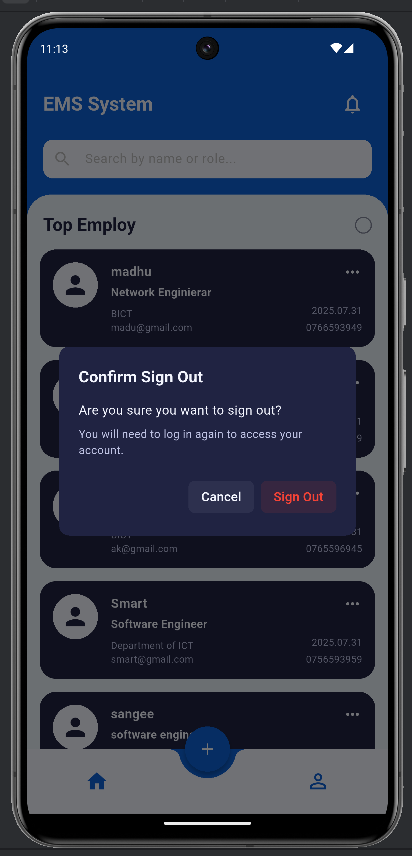

---

# EMS - Employee Management System Flutter App

A comprehensive Flutter application designed for managing employee records. It features a modern user interface, Firebase authentication (Email/Password), and real-time data synchronization with Cloud Firestore for full CRUD (Create, Read, Update, Delete,Search) operations.

## App Preview

|                                      Login Screen                                      |                            Sign Up Screen                             |                                 Forgot Password                                 |
|:--------------------------------------------------------------------------------------:|:---------------------------------------------------------------------:|:-------------------------------------------------------------------------------:|
|                      |  |  |
|                                    **Home Screen**                                     |                           **Add Employee**                            |                               **Dialogs Delete**                                |
|     |   |   |
|                                   **Welcome Screen**                                   |                          **Update Employee**                          |                               **Dialogs Signout**                               |
|  |   |  |

---

## ✨ Features Implemented

### 🔑 Authentication
-   **Email & Password Sign-Up:** Users can create a new account with their name, email, and password.
-   **Email & Password Login:** Secure login for registered users.
-   **Forgot Password:** Functionality to send password reset instructions.
-   **Persistent Login:** User session is managed by Firebase, keeping them logged in.
-   **Secure Sign-Out:** Users can sign out with a confirmation dialog to prevent accidental logouts.

### 👥 Employee Management (CRUD)
-   **Create:** Add new employees to the database via a dedicated form with real-time validation.
-   **Read:** Display a real-time, scrollable list of all employees from the Firestore database.
-   **Update:** Long-press any employee card to open a pre-filled form and update their details.
-   **Delete:** Delete any employee record with a confirmation dialog to prevent data loss.

### 🎨 UI & UX
-   **Modern Design:** A clean, modern UI with a consistent color scheme and layout across all screens.
-   **Dark Theme:** Utilizes a visually appealing dark theme for forms and primary UI elements.
-   **Responsive Layout:** The UI adapts to the on-screen keyboard by hiding the bottom navigation bar, preventing layout overflow issues.
-   **Real-time Validation:** Forms provide instant feedback to the user on input errors (e.g., invalid email format, weak password).
-   **Live Search:** The home screen features a search bar to filter the employee list by **name** or **role** in real-time.
-   **User Feedback:** The app provides clear feedback for actions using `SnackBar` messages (for success/error on CUD operations) and interactive `AlertDialogs` for confirmation.
-   **Loading Indicators:** Buttons and lists show loading spinners during asynchronous operations to inform the user that something is happening.

---

## 🚀 Setup Instructions

Follow these steps to get the project up and running on your local machine.

### 1. Prerequisites
-   You must have [Flutter](https://flutter.dev/docs/get-started/install) installed on your machine.
-   You must have a code editor like VS Code or Android Studio with the Flutter plugin installed.
-   You must have a Google account to create a Firebase project.

### 2. Clone the Repository
```bash
git clone <your-repository-url>
cd <your-project-directory>
```

### 3. Install Dependencies
Run the following command in your project's root directory to install all the required packages.
```bash
flutter pub get
```

### 4. Firebase Setup (CLI Method)
This project requires a Firebase backend. This guide uses the recommended Firebase CLI and FlutterFire CLI for a fast and automated setup.

1.  **Install Firebase CLI:**
    If you don't have it, install the Firebase command-line tools globally by running:
    ```bash
    npm install -g firebase-tools
    ```

2.  **Log into Firebase:**
    ```bash
    firebase login
    ```
    This will open a browser window for you to log in with your Google account.

3.  **Install and Configure FlutterFire:**
    -   Activate the FlutterFire CLI by running:
        ```bash
        dart pub global activate flutterfire_cli
        ```
    -   Now, connect your Flutter project to Firebase. Run the following command from the root of your project:
        ```bash
        flutterfire configure
        ```
    -   This command will:
        -   Ask you to select a Firebase project (it will list all projects in your account).
        -   Automatically register your Android, iOS, and Web apps with that project.
        -   Generate a `lib/firebase_options.dart` file in your project (this is crucial).

4.  **Enable Services in the Firebase Console:**
    The CLI connects your app, but you still need to enable the services manually in the [Firebase Console](https://console.firebase.google.com/).
    -   **Authentication:**
        -   Go to **Authentication** -> **Sign-in method**.
        -   Enable **Email/Password**.
        -   Enable **Google** (you may need to provide a project support email).
    -   **Cloud Firestore:**
        -   Go to **Firestore Database** -> **Create database**.
        -   Start in **Test mode** for initial development. This allows open read/write access.
        -   *Warning: Remember to configure proper security rules before deploying to production!*
        -   Choose a server location.

5.  **Create the 'Employee' Collection:**
    -   Once your database is created, click on **"+ Start collection"**.
    -   Set the Collection ID to `Employee`.
    -   Add your first document with the following fields to match the `employee_model.dart`:
        -   `name` (string)
        -   `role` (string)
        -   `department` (string)
        -   `email` (string)
        -   `phone` (string)
        -   `joining_date` (timestamp)

### 5. Run the App
You are now ready to run the app. Connect a device or start an emulator/simulator and run:
```bash
flutter run
```